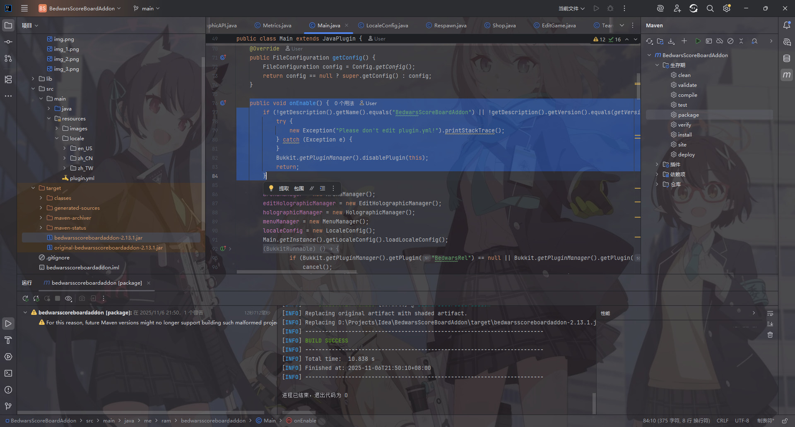
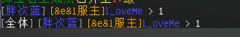
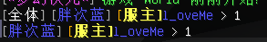
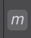
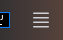
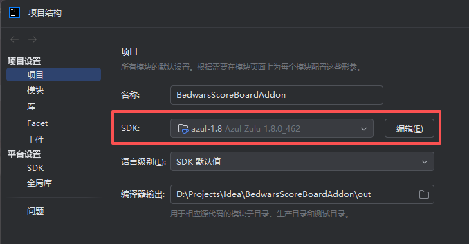

# NekoBwScoreBoardAddon 
基于 BedwarsScoreBoardAddon 重制和修复

给原帖 https://github.com/TheRamU/BedwarsScoreBoardAddon 擦屁股并且重置修复版本

# 源作者代码里面藏了什么？
验证`plugin.yml`是否被修改，太tm招笑了

# 我做了什么？

- 补全傻逼原帖作者发布的项目没有pom或者kts!
- 修复了papi变量颜色无法解析!
- 把那个傻逼没给的依赖全部补全
- 添加床的右键消息移除
- 修复前

- 修复后

## 如何构建？
打开你的idea。使用java8（1.8）点击右侧的M符号

点击生存期再点击package。你说什么？你不会选择java？

idea左上角三条杠

点击一下点击项目结构界面中的项目设置项目菜单。其中sdk就算java版本的选择
